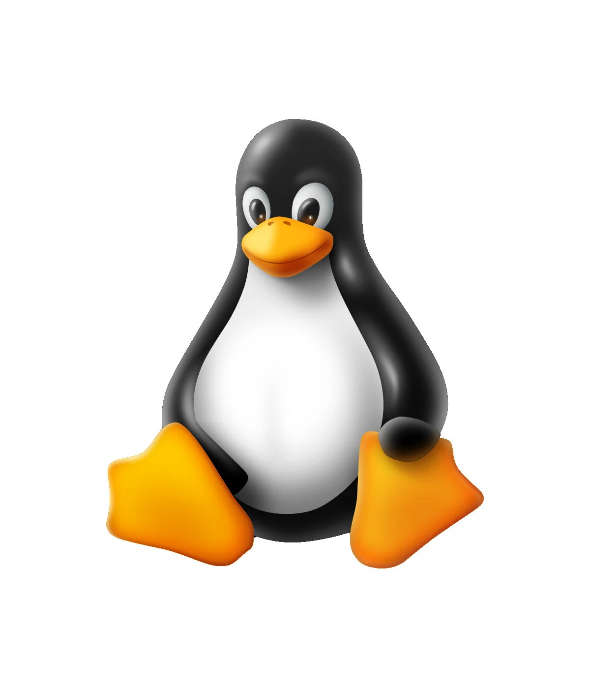

# 🚀 Portfolio Costanza Assef

<div align="center">
  
  <br>
  <strong>Portfólio profissional desenvolvido com React e estilo Linux</strong>
</div>

---

## 📋 Sobre o Projeto

Este é o portfólio profissional de **Costanza Assef**, uma desenvolvedora Full Stack apaixonada por tecnologia, inovação e aprendizado constante. O projeto foi desenvolvido com foco em design moderno, responsividade e experiência do usuário.

### ✨ Características

- 🎨 **Design Moderno**: Interface elegante com tema Linux (verde/azul)
- 📱 **Totalmente Responsivo**: Adaptado para todos os dispositivos
- ⚡ **Performance Otimizada**: Construído com React e CSS otimizado
- 🌐 **SEO Friendly**: Meta tags e estrutura semântica
- 🚀 **Deploy Automático**: Configurado para Vercel

---

## 🛠️ Tecnologias Utilizadas

### **Frontend**
- **React 18** - Biblioteca JavaScript para interfaces
- **CSS3** - Estilização avançada com animações
- **HTML5** - Estrutura semântica
- **JavaScript ES6+** - Funcionalidades modernas

### **Ferramentas & Bibliotecas**
- **Create React App** - Boilerplate inicial
- **Google Fonts** - Tipografia Inter
- **CSS Grid & Flexbox** - Layout responsivo
- **CSS Animations** - Transições suaves

---

## 🎯 Funcionalidades

### **Seções Principais**
1. **🏠 Home** - Apresentação e informações pessoais
2. **💼 O que faço** - Formação acadêmica e cursos
3. **🚀 Portfólio** - Projetos desenvolvidos
4. **🎉 Eventos** - Participações em eventos e conquistas
5. **📞 Contato** - Links sociais e informações de contato

### **Recursos Especiais**
- **Download de CV** - Currículo em PDF para download
- **Galeria de Imagens** - Fotos de eventos e participações
- **Filtros de Projetos** - Organização por categoria
- **Navegação Suave** - Scroll automático entre seções
- **Links Externos** - GitHub, LinkedIn e Medium

---

## 🚀 Como Executar

### **Pré-requisitos**
- Node.js (versão 14 ou superior)
- npm ou yarn

### **Instalação**
```bash
# Clone o repositório
git clone https://github.com/Costanza22/Portfolio-Costanza.git

# Entre na pasta do projeto
cd Portfolio-Costanza

# Instale as dependências
npm install

# Execute o projeto em desenvolvimento
npm start
```

### **Scripts Disponíveis**
```bash
npm start          # Executa em modo desenvolvimento
npm run build      # Cria build de produção
npm test           # Executa testes
npm run eject      # Ejetar configurações (irreversível)
```

---

## 📁 Estrutura do Projeto

```
Portfolio-Costanza/
├── public/                 # Arquivos públicos
│   ├── index.html         # HTML principal
│   ├── tux.webp          # Favicon Tux Linux
│   └── manifest.json     # Manifesto PWA
├── src/                   # Código fonte
│   ├── components/        # Componentes React
│   │   ├── Header.js     # Navegação principal
│   │   ├── Hero.js       # Seção de apresentação
│   │   ├── About.js      # Sobre mim e experiência
│   │   ├── Courses.js    # Formação e cursos
│   │   ├── Projects.js   # Portfólio de projetos
│   │   ├── Certificates.js # Eventos e conquistas
│   │   ├── Links.js      # Contato e redes sociais
│   │   └── Footer.js     # Rodapé
│   ├── assets/           # Imagens e arquivos
│   │   ├── costanza perfil.jpg
│   │   ├── codecon*.jpg  # Imagens do Codecon
│   │   ├── summit ia*.jpg # Imagens do Summit IA
│   │   └── Curriculo*.pdf # CV em PDF
│   ├── App.js            # Componente principal
│   ├── App.css           # Estilos globais
│   └── index.js          # Ponto de entrada
├── package.json           # Dependências e scripts
└── README.md             # Este arquivo
```

---

## 🎨 Design System

### **Paleta de Cores**
- **Primária**: `#00ff88` (Verde Linux)
- **Secundária**: `#0088ff` (Azul)
- **Fundo**: `#0d1117` (Preto escuro)
- **Fundo Secundário**: `#161b22` (Cinza escuro)
- **Texto**: `#ffffff` (Branco)

### **Tipografia**
- **Fonte Principal**: Inter (Google Fonts)
- **Pesos**: 300, 400, 500, 600, 700, 800
- **Hierarquia**: Títulos, subtítulos, corpo e legendas

### **Componentes**
- **Cards**: Bordas arredondadas com sombras
- **Botões**: Gradientes e efeitos hover
- **Navegação**: Transparência com backdrop-filter
- **Animações**: Transições suaves e fade-in

---

## 📱 Responsividade

O portfólio é totalmente responsivo e funciona perfeitamente em:

- 📱 **Mobile**: 320px - 768px
- 💻 **Tablet**: 768px - 1024px
- 🖥️ **Desktop**: 1024px+

### **Breakpoints CSS**
```css
/* Mobile First */
@media (min-width: 768px) { /* Tablet */ }
@media (min-width: 1024px) { /* Desktop */ }
@media (min-width: 1200px) { /* Large Desktop */ }
```

---

## 🚀 Deploy

### **Vercel (Recomendado)**
1. Conecte o repositório GitHub
2. Configure o framework como "Create React App"
3. Deploy automático a cada push

### **Outras Opções**
- **Netlify**: Similar ao Vercel
- **GitHub Pages**: Gratuito para repositórios públicos
- **Firebase Hosting**: Solução Google

---

## 🔧 Configurações

### **Variáveis de Ambiente**
```env
REACT_APP_TITLE=Costanza Assef - Portfolio
REACT_APP_DESCRIPTION=Portfólio profissional de Costanza Assef
```

### **Build de Produção**
```bash
npm run build
```
O build será criado na pasta `build/` e pode ser servido por qualquer servidor web estático.

---

## 📊 Performance

### **Métricas**
- **Lighthouse Score**: 90+ em todas as categorias
- **First Contentful Paint**: < 1.5s
- **Largest Contentful Paint**: < 2.5s
- **Cumulative Layout Shift**: < 0.1

### **Otimizações**
- Imagens otimizadas e responsivas
- CSS e JavaScript minificados
- Lazy loading para componentes
- Cache de assets estáticos

---

## 🤝 Contribuição

Este é um projeto pessoal, mas sugestões são bem-vindas! Para contribuir:

1. Faça um fork do projeto
2. Crie uma branch para sua feature (`git checkout -b feature/AmazingFeature`)
3. Commit suas mudanças (`git commit -m 'Add some AmazingFeature'`)
4. Push para a branch (`git push origin feature/AmazingFeature`)
5. Abra um Pull Request

---

## 📄 Licença

Este projeto está sob a licença MIT. Veja o arquivo `LICENSE` para mais detalhes.

---

## 👤 Sobre a Autora

**Costanza Assef** é uma desenvolvedora Full Stack com experiência em:

- **Frontend**: React, JavaScript, HTML, CSS
- **Backend**: Python, Node.js
- **IA & ML**: Machine Learning, Python
- **Ferramentas**: Tableau, Git, AWS
- **Idiomas**: Português, Inglês, Alemão

### **Experiência Profissional**
- **Desenvolvedor Web Júnior** - Amazon (Freelance)
- **Analista de Suporte de TI** - Schulze Advogados
- **Estagiária de Inteligência de Mercado** - WEG

### **Formação**
- **Pós-graduação em IA** - UFPR
- **Cursos diversos** - Rocketseat, freeCodeCamp, Apple Developer Academy

---

## 📞 Contato

- **Email**: pinassef22@gmail.com
- **WhatsApp**: (47) 98804-1237
- **LinkedIn**: [Costanza Assef](https://www.linkedin.com/in/costanzaassef/)
- **GitHub**: [@Costanza22](https://github.com/Costanza22)
- **Medium**: [@costanza22](https://medium.com/@costanza22)

---

<div align="center">
  <p>Desenvolvido com 💚 e React</p>
  <p>🐧 Powered by Linux Style</p>
</div>
